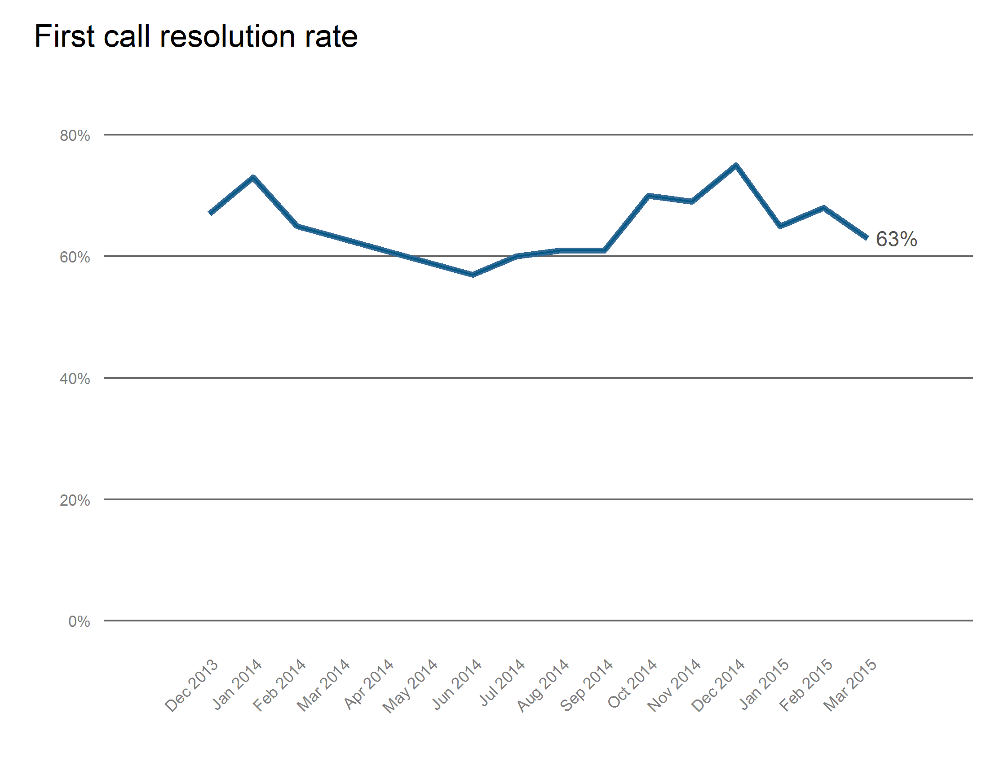
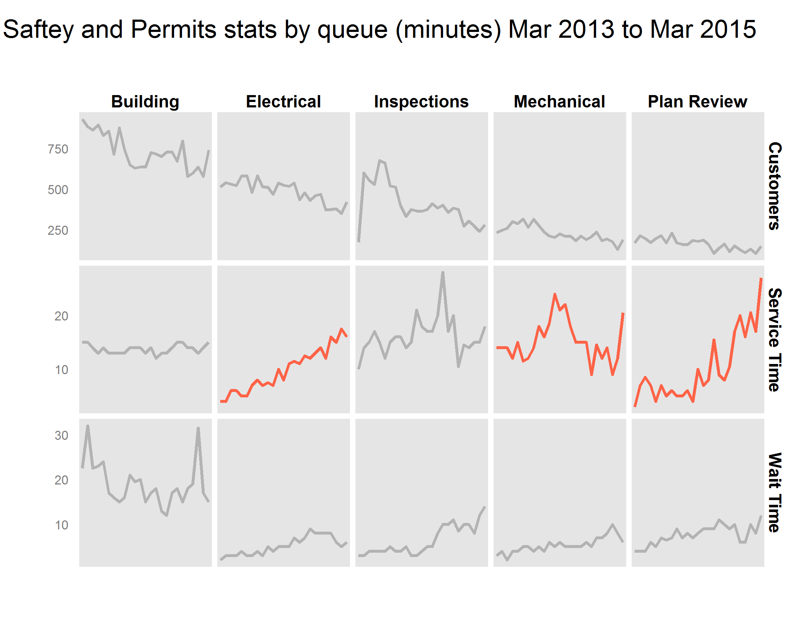
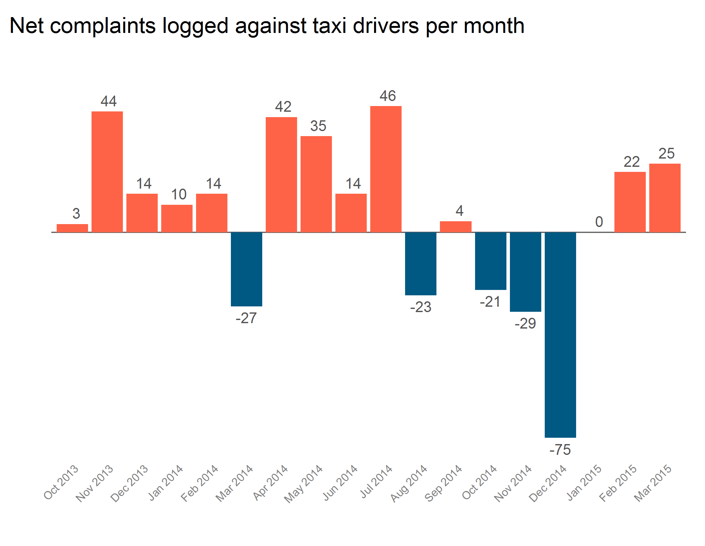

# Customer Service STAT

## To do

 * Consider better way to subset to reporting period
 * Consider faster way of created month-year variables that factors (factors are sloowwww to process)

## Usage

This bundle of scripts looks for csvs and Excel workbooks in a directory called `data`, does some counting and averaging, and produces some charts which are saved in a directory called `output`. All the loading and saving paths are hard-coded, so make sure your directory tree matches or change the paths.

Run `main.R` after making sure you have the packages below installed, and you should have all the charts you'll need for a good old Customer Service STAT presentation.

## Dependencies

 * gdata
 * zoo
 * dplyr
 * ggplot2
 * lubridate
 * stringr
 * scales
 * reshape2

## Charts

These are some of the charts this script produces.

